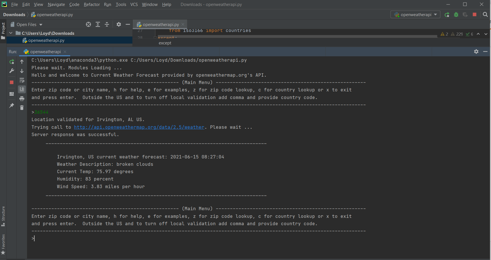

# Open Weather API

## Description

Python [code](code/openweatherapi.py) to pull location specific weather information from the Open Weather API. 

* Security note: You will need to retrieve an API key from http://api.openweathermap.org and replace the apiKey value.

## Screenshots

Here is one of the simplest executions of the program

## Tools

* Python
* Pycharm

## Library Requirements

* requests
* textwrap
* iso3166
* zipcodes (avaiable from pypi.org)
* os
* datetime